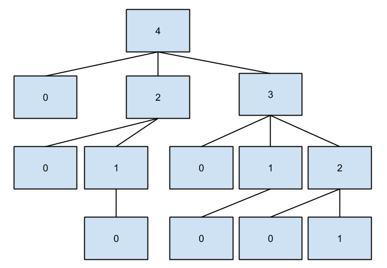
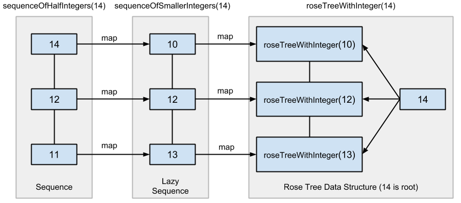

.. highlight:: objective-c
.. _Generator:
.. _Generators:

==========
Generators
==========

Generators specify directed, random data creation.  This means generators know
how to create the given data type and how to shrink it.  For Objective-C
compatibility, generators are only allowed to produce Objective-C objects
(``id``).

All generators conform to the ``FOXGenerator`` protocol and are expected to
return a lazy rose tree for consumption by the :doc:`Fox runner </runner>`.

The power of generators are their composability. Shrinking is provided for
*free* if you compose with Fox's built-in generators. In fact, most of Fox's
built-in generators are composed on top of ``FOXChoose``. Of course you can
provide custom shrinking strategies as needed. 

For the typed programming enthusiast, generators are functions expected to
conform to this type:

    ``(id<FOXRandom>, uint32_t) -> FOXRoseTree<U>`` where ``U`` is an
    Objective-C object.

There are few special cases to this rule. For example, ``FOXAssert`` expects
``FOXRoseTree<FOXPropertyResult>`` which the ``FORForAll`` generator satisfies.

.. note::
    For Haskell programmers, Fox is a decendant to Haskell's QuickCheck 2.
    Generators are a monadic type which generation is done via the protocol
    and shrinking is specified by the returned lazy rose tree.

For the list of all generators that Fox provides, read about
:doc:`generators_reference`.

.. _Building Custom Generators:

Building Custom Generators
==========================

It's easy to compose the built-in generators to produce custom generators for
any data type. Let's say we want to generate random permutations of a Person
class::

    // value object. Implementation assumed
    @interface Person : NSObject
    @property (nonatomic, copy) NSString *firstName;
    @property (nonatomic, copy) NSString *lastName;
    @end

We can represent this Person data using by generating an array of values or
dictionary of values. Here's how it looks using a dictionary in an property
assertion::

    id<FOXGenerator> dictionaryGenerator = FOXDictionary(@{
        @"firstName": FOXAlphabeticalString(),
        @"lastName": FOXAlphabeticalString()
    });
    FOXAssert(FOXForAll(dictionaryGenerator, ^BOOL(NSDictionary *data) {
        Person *person = [[Person alloc] init];
        person.firstName = data[@"firstName"];
        person.lastName = data[@"lastName"];
        // assert with person
    }));

But we want this to be reusable. Using ``FOXMap``, we can create a new
generator based on the ``dictionaryGenerator``::

    // A new generator that creates random person
    id<FOXGenerator> AnyPerson(void) {
        id<FOXGenerator> dictionaryGenerator = FOXDictionary(@{
            @"firstName": FOXAlphabeticalString(),
            @"lastName": FOXAlphabeticalString()
        });
        return FOXMap(dictionaryGenerator, ^id(NSDictionary *data) {
            Person *p = [[Person alloc] init];
            p.firstName = data[@"firstName"];
            p.lastName = data[@"lastName"];
            return p;
        });
    }

And we can use it like any other generator::

    FOXAssert(FOXForAll(AnyPerson(), ^BOOL(Person *person) {
        // assert with person
    }));

You can see the :ref:`reference <Built-in Generators>` for all the generators.
Most common generators can be built from the provided mappers.

.. _How Shrinking Works:

How Shrinking Works
===================

Generators are just functions that accept a random number generator and a size
hint as arguments and then return a rose tree of values.

Rose trees sound fancy, but they're generic trees with an arbitrary number of
branches. Each node in the tree represents a value. Fox generators create rose
trees instead of individual values. This allows the :doc:`runner </runner>` to
shrink the value by traversing through the children of the tree.

The main shrinking implementation Fox uses are for integers (via
``FOXChoose``). For example, if a 4 was generated, the rose tree that
``FOXChoose`` generates would look like this:

The children of each node represents a smaller value that its parent. Fox will
walk depth-first through this tree when a test fails to shrink to the smallest
value.

Based on the diagram, the algorithm for shrinking integers prefers:

- Reducing to zero immediately
- Reducing to 50% of the original value
- Reducing the value by 1

This makes it more expensive to find larger integers (because of the redundant
checking of zero), but it is generally more common to immediately shrink to the
smallest value.

.. _Building Generators with Custom Shrinking:

Writing Generators with Custom Shrinking
========================================

.. warning::
    **This is significantly more complicated than composing generators**, which
    is what you want the majority of the time. Composing existing generators
    will also provide shrinking for free.

.. warning::
    This section assumes knowledge functional programming concepts. It's worth
    reading up on function composition, map/reduce, recursion, and lazy computation.

It is worth reading up on :ref:`How Shrinking Works` if you haven't already.

Let's write a custom integer generator that shrinks to ``10`` instead of zero.
We won't be using anything built on top of ``FOXChoose`` for demonstrative
purposes, but we will be using Fox's :ref:`debugging functions`.

For the sake of brevity, we'll ignore the problem of maximum storage of integers,
but when writing your generators this matters.

Step one, we can easily always generate 10 by returning a child-less rose tree::

    id<FOXGenerator> MyInteger(void) {
        FOXGenerate(^FOXRoseTree *(id<FOXRandom> random, NSUInteger size) {
            return [[FOXRoseTree alloc] initWithValue:@10];
        });
    }

``FOXGenerate`` is an easy way to create a generator without having to create
an object that conforms to ``FOXGenerator``. The block is the method body of
the one method that the protocol requires.

This is, in fact, what ``FOXReturn`` does. However, we don't get any
randomness::

    // FOXSample generates 10 random values using the given generator.
    FOXSample(MyInteger()); // => @[@3];

So let's use the random number generator provided. We'll also use the size to
dictate the size we want::

    id<FOXGenerator> MyInteger(void) {
        FOXGenerate(^FOXRoseTree *(id<FOXRandom> random, NSUInteger size) {
            NSInteger lower = -((NSInteger)size);
            NSInteger upper = (NSInteger)size;
            NSInteger randomInteger = [random randomIntegerWithinMinimum:lower
                                                              andMaximum:upper];
            return [[FOXRoseTree alloc] initWithValue:@(randomInteger)];
        });
    }

We now generate random integers! But we still don't have any shrinking::

    // Random integers
    FOXSample(MyInteger());
    // => @[@-30, @103, @188, @-184, @-22, @-118, @147, @-186, @-128, @-68]

    // FOXSampleShrinking takes the first 10 values of the rose tree.
    // The first value is the generated value. Subsequent values are
    // shrinking values from the first one.
    FOXSampleShrinking(MyInteger()) // => @[@-8]; there's no shrinking

Let's add a simple shrinking mechanism, we can populate the children of the
rose tree we return::

    id<FOXGenerator> MyInteger(void) {
        FOXGenerate(^FOXRoseTree *(id<FOXRandom> random, NSUInteger size) {
            // remember, we don't care about min / max integer boundaries
            // for this example.
            NSInteger lower = -((NSInteger)size);
            NSInteger upper = (NSInteger)size;
            NSInteger randomInteger = [random randomIntegerWithinMinimum:lower
                                                              andMaximum:upper];
            id<FOXSequence> children = [FOXSequence sequenceFromArray:@[[[FOXRoseTree alloc] initWithValue:@10]]];
            return [[FOXRoseTree alloc] initWithValue:@(randomInteger)
                                             children:children];
        });
    }
    // Shrinking once
    FOXSampleShrinking(MyInteger()) // => @[@-8, @10];

Of course, we don't properly handle shrinking for all variations.
``FOXSequence`` is a port of `Clojure's sequence abstraction`_. They provide
opt-in laziness for Fox's rose tree.

.. _Clojure's sequence abstraction: http://clojure.org/sequences

We'll mimic the behavior of Fox's integer shrinking algorithm:

- Shrink to 10.
- Shrink towards 10 by 50% of its current value.
- Shrink towards 10 by 1.

We'll do this by defining functions to recursively create our rose tree::

    // sequenceOfHalfIntegers(@14) -> SEQ(@14, @12, @11)
    static id<FOXSequence> sequenceOfHalfIntegers(NSNumber *n) {
        if ([n isEqual:@10]) {
            return nil;
        }
        NSNumber *halfN = @(([n integerValue] - 10) / 2 + 10);
        return [FOXSequence sequenceWithObject:n
                             remainingSequence:sequenceOfHalfIntegers(halfN)];
    }

``sequenceOfHalfIntegers`` creates a sequence of integers that are half
increments from n to 10 starting with n. ``nil`` is equivalent to an empty
sequence. Next we define the children values::

    // eg - sequenceOfSmallerIntegers(@14) -> SEQ(@10, @12, @13)
    static id<FOXSequence> sequenceOfSmallerIntegers(NSNumber *n) {
        if ([n isEqual:@10]) {
            return nil;
        }
        return [sequenceOfHalfIntegers(n) sequenceByMapping:^id(NSNumber *m) {
            return @([n integerValue] - ([m integerValue] - 10));
        }];
    }

``sequenceOfSmallerIntegers`` creates a lazy sequence of values between n and
10 (including 10). Each element is ``(n - each half number difference to 10)``.
Finally, we need to convert this sequence into a rose tree::

    static FOXRoseTree *roseTreeWithInteger(NSNumber *n) {
        id<FOXSequence> smallerIntegers = sequenceOfSmallerIntegers(n);
        id<FOXSequence> children = [smallerIntegers sequenceByMapping:^id(NSNumber *smallerInteger) {
            return roseTreeWithInteger(smallerInteger);
        }];
        return [[FOXRoseTree alloc] initWithValue:n children:children];
    }

``sequenceOfSmallerIntegers`` creates a rose tree for a given number. The
children are values from ``sequenceOfSmallerIntegers(n)``. The rose tree is
recursively generated until ``sequenceOfSmallerIntegers`` returns an empty
sequence (when the number is 10).

Finally, we wire everything together in our function that defines our
generator::

    id<FOXGenerator> MyInteger(void) {
        FOXGenerate(^FOXRoseTree *(id<FOXRandom> random, NSUInteger size) {
            // remember, we don't care about min / max integer boundaries
            // for this example.
            NSInteger lower = -((NSInteger)size);
            NSInteger upper = (NSInteger)size;
            NSInteger randomInteger = [random randomIntegerWithinMinimum:lower
                                                              andMaximum:upper];
            return roseTreeWithInteger(@(randomInteger));
        });
    }

Conceptually, our data pipeline looks like this:

Now we can generate values that shrink to 10! Obviously, this can be applied to
more interesting shrinking strategies.
