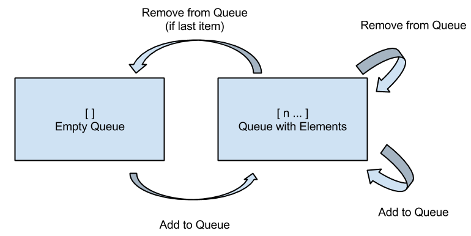

.. highlight:: objective-c

Tutorial
========

If you haven't installed Fox yet, read up on :doc:`installation`.

This tutorial will use the Objective-C API of Fox. There is a similar
Swift API but that's currently alpha and subject to change.

Starting with an Example
------------------------

Throughout this tutorial, we'll cover the basics of writing property tests. To
better understand property tests, let's start with an example-based one first::

    - (void)testSort {
        NSArray *sortedNumbers = [MySorter sortNumbers:@[@5, @2, @1]];
        XCTAssertEqualObjects(sortedNumbers, @[@1, @2, @5]);
    }

This is a simple example test about sorting numbers. Let's break down parts of
this test and see how Fox rebuilds it up::

    - (void)testSort {
        // inputs
        NSArray *input = @[@5, @2, @1];
        // behavior to test
        NSArray *sortedNumbers = [MySorter sortNumbers:input];
        // assertion
        XCTAssertEqualObjects(sortedNumbers, @[@1, @2, @5]);
    }

Fox takes these parts and separates them.

- Inputs are produced using :ref:`generator <generators>`. Generators describe
  the type of data to generate.
- Behavior to test remains the same.
- The assertion is based on logical statements of the subject and/or based on
  the generated inputs. The assertions as usually describe properties of the
  subject under test.

Let's see how we can convert them to Fox property tests.

Converting to a Property
------------------------

To convert the sort test into the given property, we describe the intrinsic
property of the code under test.

For sorting, the resulting output should have the smallest elements in the
start of the array and every element afterwards should be greater than or equal
to the element before it::

    - (void)testSortBySmallestNumber {
        id<FOXGenerator> arraysOfIntegers = FOXArray(FOXInteger());
        FOXAssert(FOXForAll(arraysOfIntegers, ^BOOL(NSArray *integers) {
            // subject under test
            NSArray *sortedNumbers = [MySorter sortNumbers:integers];
            // assertion
            NSNumber *previousNumber = nil;
            for (NSNumber *n in sortedNumbers) {
                if (!previousNumber || [previousNumber integerValue] <= [n integerValue]) {
                    previousNumber = n;
                } else {
                    return NO; // fail
                }
            }
            return YES; // succeed
        }));
    }

Let's break that down:

- ``FOXInteger`` is a :ref:`generator <generators>` that describes how to
  produce random integers (NSNumbers).
- ``FOXArray`` is a :ref:`generator <generators>` that describes how to
  generate arbitrary arrays.  It takes another generator as an argument. In
  this case, we're giving it an integer generator to produce randomly sized
  array of random integers.
- ``FOXForAll`` defines a property that should always hold true. It takes
  two arguments, the generator to produce and a block on how to assert against
  the given generated input.
- ``FOXAssert`` is how Fox asserts against properties. It will raise an
  exception if a property does not hold. They're part of Fox's :doc:`runner
  <runner>` infrastructure which actually generates all test cases.

The test can be read as:

    Assert that **for all array of integers** named ``integer``, sorting
    ``integers`` should produce ``sortedNumbers``. ``sortedNumbers`` is an
    array where the first number is the smallest and subsequent elements are
    greater than or equal to the element that preceeds it.

Diagnosing Failures
-------------------

The interesting feature of Fox occurs only when properties fail. Let's write
code that will fail the property we just wrote::

    + (NSArray *)sortNumbers:(NSArray *)numbers {
        NSMutableArray *sortedNumbers = [[numbers sortedArrayUsingSelector:@selector(compare:)] mutableCopy];
        if (sortedNumbers.count >= 5) {
            id tmp = sortedNumbers[0];
            sortedNumbers[0] = sortedNumbers[1];
            sortedNumbers[1] = tmp;
        }
        return sortedNumbers;
    }

Some nefarious little code we added there! We run again we get to see Fox work::

    Property failed with: ( 0, 0, 0, 0, "-1" )
    Location:   // /Users/jeff/workspace/FoxExample/FoxExampleTests/FoxExampleTests.m:41
      FOXForAll(arraysOfIntegers, ^BOOL(NSArray *integers) {
       NSArray *sortedNumbers = [self sortNumbers:integers];
       NSNumber *previousNumber = ((void *)0);
       for (NSNumber *n in sortedNumbers) {
       if (!previousNumber || [previousNumber integerValue] <= [n integerValue]) {
       previousNumber = n;
       }
       else {
       return __objc_no;
       }
       }
       return __objc_yes;
       }
      );

    RESULT: FAILED
     seed: 1417500369
     maximum size: 200
     number of tests before failing: 8
     size that failed: 7
     shrink depth: 8
     shrink nodes walked: 52
     value that failed: (
        "-3",
        "-3",
        1,
        "-2",
        "-7",
        "-5"
    )
     smallest failing value: (
        0,
        0,
        0,
        0,
        "-1"
    )

The first line describes the smallest failing example that failed. It's placed
there for convenience::

    Property failed with: ( 0, 0, 0, 0, "-1" )

The rest of the first half of the failure describes the location and property
that failed.

The latter half of the failure describes specifics on how the smallest failing
example was reached:

- ``seed`` is the random seed that was used to generate the series of tests to
  run. Along with the maximum size, this can be used to reproduce failures Fox
  generated.
- ``maximum size`` is the maximum size hint that Fox used when generating tests.
  This is useful for reproducing test failures when paired with the seed.
- ``number of tests before failing`` describes how many tests were generated
  before the failing test was generated. Mostly for technical curiosity.
- ``size that failed`` describes the size that was used to generate the
  original failing test case. The size dicates the general size of the data
  generated (eg - larger numbers and bigger arrays).
- ``shrink depth`` indicates how many "changes" performed to shrink the
  original failing test to produce the smallest one. Mostly for technical
  curiosity.
- ``shrink nodes walked`` indicates how many variations Fox produced to find
  the smallest failing test. Mostly for technical curiosity.
- ``value that failed`` the original generated value that failed the property.
  This is before Fox performed any shrinking.
- ``smallest failing value`` the smallest generated value that still fails the
  property. This is identical to the value on the first line of this failure
  description.

So what happened? Fox generates random data until a failure occurs. Once a
failure occurs, Fox starts the shrinking process. The shrinking behavior is
generator-dependent, but generally alters the data towards the "zero" value:

- For integers, that means moving towards 0 value.
- For arrays, each element shrinks as well as the number of elements
  moves towards zero.

Each time the value shrinks, Fox will verify it against the property to ensure
the test still fails.  This is a brute-force process of elimination is an
effective way to drop irrevelant noise that random data generation typically
produces.

Notice that the last element has significance since it failed to shrink all the
way to zero like the other elements. Also note that just because a value has
been shrunk to zero doesn't exclude it's potential significance, but it's
usually less likely to be significant. In this case, the second to last element
happens to be significant.

.. warning:: Due to the ``maximum size`` configuration. Fox limits the range
             of random integers generated. Fox's default maximum size is 200.
             Observe when you change the failure case to require more than 200
             elements for the sort example. See :ref:`Configuring Test
             Generation` for more information.

Testing Stateful APIs
---------------------

Now this is all well and good for testing purely functional APIs - where the
same input produces the same output. What's more interesting is testing
stateful APIs.

Before we start, let's talk about the conceptual model Fox uses to verify
stateful APIs. We can model **API calls as data** using Fox's :ref:`generator
<generators>` system.

As a simple case, let's test a `Queue`_. We can add and remove objects to it.
Removing objects returns the first item in the Queue:

- ``[queue add:1]``
- ``[queue remove] // => returns 1``
- ``[queue add:2]``
- ``[queue add:3]``
- ``[queue remove] // => returns 2``
- ``[queue remove] // => returns 3``

Just generating a series of API calls isn't enough. Fox needs more information
about the API:

- **Which API calls are valid to make at any given point?** This is specified
  in Fox as *preconditions*.
- **What assertions should be after any API call?** This is specified in Fox
  as *postconditions*.

This is done by describing a `state machine`_. In basic terms, a state machine
is two parts: state and transitions.

State indicates data that persists between
transitions. Transitions describe how that state changes over time. Transitions
can have prerequisites before allowing them to be used.

For this example, we can model the API as a state machine: with transitions for
each unique API call, and its state representing what we think the queue should
manage. In this case, we'll naively choose an array of the queue's contents as
the state.

From there, Fox can **generate a sequence of state transitions** that conform
to the state machine. This allows Fox to generate valid sequences of API calls.

We can translate the diagram into code by configuring a
``FOXFiniteStateMachine``::

    - (void)testQueueBehavior {
        // define the state machine with its initial state.
        FOXFiniteStateMachine *stateMachine = [[FOXFiniteStateMachine alloc] initWithInitialModelState:@[]];

        // define the state transition for -[Queue addObject:]
        // we'll only be using randomly generated integers as arguments.
        // note that nextModelState should not mutate the original model state.
        [stateMachine addTransition:[FOXTransition byCallingSelector:@selector(addObject:)
                                                    withGenerator:FOXInteger()
                                                    nextModelState:^id(id modelState, id generatedValue) {
                                                        return [modelState arrayByAddingObject:generatedValue];
                                                    }]];

        // define the state machine for -[Queue removeObject]
        FOXTransition *removeTransition = [FOXTransition byCallingSelector:@selector(removeObject)
                                                            nextModelState:^id(id modelState, id generatedValue) {
                                                                return [modelState subarrayWithRange:NSMakeRange(1, [modelState count] - 1)];
                                                            }];
        removeTransition.precondition = ^BOOL(id modelState) {
            return [modelState count] > 0;
        };
        removeTransition.postcondition = ^BOOL(id modelState, id previousModelState, id subject, id generatedValue, id returnedObject) {
            // modelState is the state machine's state after following the transition
            // previousModelState is the state machine's state before following the transition
            // subject is the subject under test. You should not provoke any mutation changes here.
            // generatedValue is the value that the removeTransition generated. We're not using this value here.
            // returnedObject is the return value of calling [subject removeObject].
            return [[previousModelState firstObject] isEqual:returnedObject];
        };
        [stateMachine addTransition:removeTransition];

        // generate and execute an arbitrary sequence of API calls
        id<FOXGenerator> executedCommands = FOXExecuteCommands(stateMachine, ^id{
            return [[Queue alloc] init];
        });
        // verify that all the executed commands properly conformed to the state machine.
        FOXAssert(FOXForAll(executedCommands, ^BOOL(NSArray *commands) {
            return FOXExecutedSuccessfully(commands);
        }));
    }

.. note:: If you prefer to not have inlined transition definitions, you can
          always choose to conform to ``FOXStateTransition`` protocol instead
          of using ``FOXTransition``.

We can now run this to verify the behavior of the queue. This takes more time
that the previous example. But Fox's execution time can be tweak if you want
faster feedback versus a more thorough test run. See :ref:`Configuring Test
Generation`.

Just to be on the same page, here's a naive implementation of the queue that
passes the property we just wrote::

    @interface Queue : NSObject
    - (void)addObject:(id)object;
    - (id)removeObject;
    @end

    @interface Queue ()
    @property (nonatomic) NSMutableArray *items;
    @end

    @implementation Queue

    - (instancetype)init {
        self = [super init];
        if (self) {
            self.items = [NSMutableArray array];
        }
        return self;
    }

    - (void)addObject:(id)object {
        [self.items addObject:object];
    }

    - (id)removeObject {
        id object = self.items[0];
        [self.items removeObjectAtIndex:0];
        return object;
    }

    @end

.. note:: Testing a queue with this technique has obvious testing problems
          (being the test is like the implementation). But for larger
          integration tests, this can be useful. They just happen to be less to
          be concise examples.

To break this, let's modify the queue implementation::

    - (void)addObject:(id)object {
        if (![object isEqual:@4]) {
            [self.items addObject:object];
        }
    }

Running the tests again, Fox shows us a similar failure like sort::

    Property failed with: @[ [subject addObject:4] -> (null), [subject removeObject] -> (null) (Postcondition FAILED) Exception Raised: *** -[__NSArrayM objectAtIndex:]: index 0 beyond bounds for empty array Model before: ( 4 ) Model after: ( ), ]
    Location:   // /Users/jeff/workspace/FoxExample/FoxExampleTests/FoxExampleTests.m:68
    FOXForAll(executedCommands, ^BOOL(NSArray *commands) {
    return FOXExecutedSuccessfully(commands);
    }
    );

    RESULT: FAILED
    seed: 1417510193
    maximum size: 200
    number of tests before failing: 13
    size that failed: 12
    shrink depth: 10
    shrink nodes walked: 16
    value that failed: @[
    [subject addObject:-1] -> (null),
    [subject addObject:-8] -> (null),
    [subject addObject:4] -> (null),
    [subject addObject:12] -> (null),
    [subject removeObject] -> -1,
    [subject addObject:4] -> (null),
    [subject addObject:10] -> (null),
    [subject removeObject] -> -8,
    [subject removeObject] -> 12 (Postcondition FAILED)
        Model before: (
        4,
        12,
        4,
        10
    )
        Model after: (
        12,
        4,
        10
    ),
    ]
    smallest failing value: @[
    [subject addObject:4] -> (null),
    [subject removeObject] -> (null) (Postcondition FAILED)
        Exception Raised: *** -[__NSArrayM objectAtIndex:]: index 0 beyond bounds for empty array
        Model before: (
        4
    )
        Model after: (
    ),
    ]

Here we can see the original generated test that provoked the failure:

- ``[subject addObject:-1]``
- ``[subject addObject:-8]``
- ``[subject addObject:4]``
- ``[subject addObject:12]``
- ``[subject removeObject] -> -1``
- ``[subject addObject:4]``
- ``[subject addObject:10]``
- ``[subject removeObject] -> -8``
- ``[subject removeObject] -> 12 (Postcondition FAILED)``

That's not as nice to debug as the test after shrinking:

- ``[subject addObject:4]``
- ``[subject removeObject] -> (null) (Postcondition FAILED)`` - out of bounds exception raised.

You may be wondering why the ``removeObject`` call is still required. This is
the only way assertions are made against the queue. Just calling ``addObject:``
doesn't reveal any issues with an implementation.

And that's most of the power of Fox. You're ready to start writing property
tests! Remember:

    "Program testing can at best show the presence of errors, but never their
    absence."

    -- Dijkstra

If you want read on, continue to the core of Fox's design: :ref:`generators`.

.. _Queue: http://en.wikipedia.org/wiki/Queue_(abstract_data_type)
.. _state machine: http://en.wikipedia.org/wiki/Finite-state_machine
.. _github README: https://github.com/jeffh/Fox#reference

